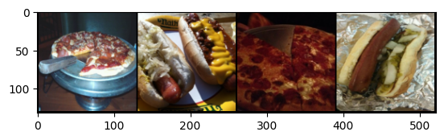
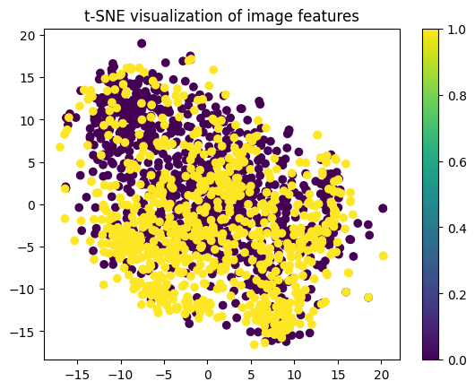
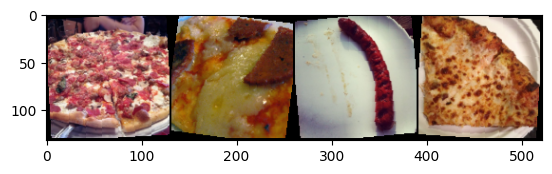

### 1. Визуализация данных

**Выводы:**

* Я убедился, что изображения загружены правильно и отображаются корректно.
* Я визуально оценил различия между изображениями пиццы и хотдогов.
* Я проверил, что трансформации (например, изменение размера) применяются корректно.

### 2. Распределение классов

**Выводы:**

* Я оценил баланс классов в наборе данных. Классы пиццы и хотдогов сбалансированы, что хорошо для обучения модели.

### 3. Статистический анализ изображений

**Выводы:**

* Я вычислил среднее значение интенсивностей пикселей для всех изображений. Эти значения могут быть полезны для нормализации данных перед обучением модели.

### 4. Визуализация данных с использованием t-SNE

**Выводы:**

* Я визуализировал высокоразмерные данные в двухмерном пространстве и оценил, насколько хорошо данные разделяются на два класса (пицца и хотдог).
* Кластеры сильно пересекаются, что может указывать на необходимость дополнительных признаков или более сложных моделей.

### 5. Проверка аугментации данных

**Выводы:**

* Я проверил, как аугментация влияет на изображения.

  

### Общие выводы:

* **Качество данных:** Данные выглядят адекватно для задачи классификации. Нет явных артефактов или сильно искаженных изображений.
* **Баланс классов:** Классы сбалансированы.
* **Нормализация:** Среднее значение интенсивностей пикселей дает основу для нормализации данных.
* **Визуализация данных** : Я понял, что фотографии очень похожи.
